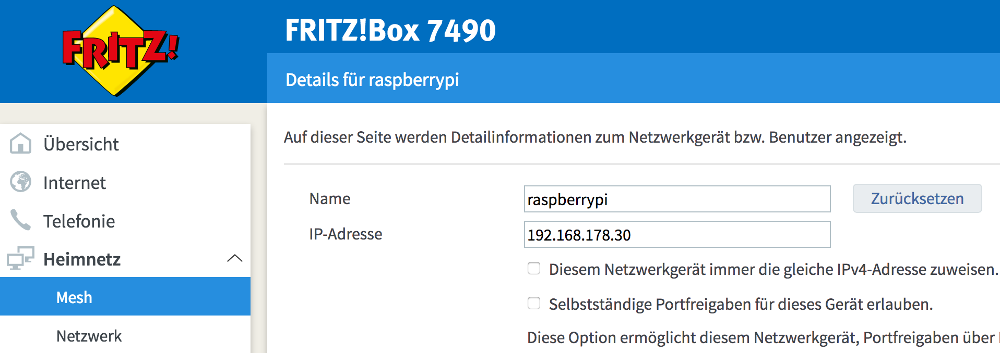

# raspberry-ansible
Setup a new Raspberry Pi 3 B+ with Ansible

I bought a new Raspberry Pi 3 B+ and as I love to automate things, I want to automate the setup as far as possible. This repo contains my notes, what I did - maybe it is of help to you.


### HowTo configure Raspberry headless to expose SSH

I want to use my Raspberry as a home server only - so no need for Desktops whatsoever. And it will only be connected via Ethernet - directly to my Router.

1. Install [Raspberry Pi Imager](https://www.raspberrypi.com/software/)
2. Connect the SD card to your Mac
3. Install Raspberry PI OS LITE (no desktop needed)

4. Remove and reconnect SD card to your Mac

5. Enable SSH on Raspberry by creating `ssh` file on the SD card inside `/boot` directory (because by default Raspbian disables sshd, we have to enable it):

```
touch /Volumes/boot/ssh
```

6. Remove the SD card, plug it into your Raspberry and then connect your Pi to your Network via Ethernet (additional configuration needed for Wifi). 
7. Plug in your power adapter and wait for your Pi to boot up.
8. Try to connect to your Pi via SSH using `pi` user & password `raspberry`. Therefore you may need to find your Raspberry's IP at in your Router - or you try the second option:


```
ssh pi@yourIpHere

# or without IP
ssh pi@raspberrypi.local
```

10. Initial configuration

Run `sudo raspi-config` to change the default password (__1 Change User Password__) and expand the file system, to make the entire space of SD card available (__7 Advanced Options / A1 Expand Filesystem__). Then go to __Finish__, which will issue a reboot.

11. Copy your public key to your Pi

Prereq: Have your public key available (e.g. by generating a new keypair with `ssh-keygen`)

```
ssh-copy-id -i ~/.ssh/id_rsa.pub pi@raspberrypi.local
```

### Configure env variables
Goto ```monitoring/files/src```. 
Copy ```.env.example``` to ```.env``` and set desired grafana username and password.

### Install Docker with Ansible

Run the Ansible playbook with:

```
ansible-playbook rpi-docker.yml -i hosts
```


# Links

* https://medium.com/@viveks3th/how-to-bootstrap-a-headless-raspberry-pi-with-a-mac-6eba3be20b26
* https://github.com/yusekiya/raspi3_setup
* https://hackernoon.com/raspberry-pi-headless-install-462ccabd75d0